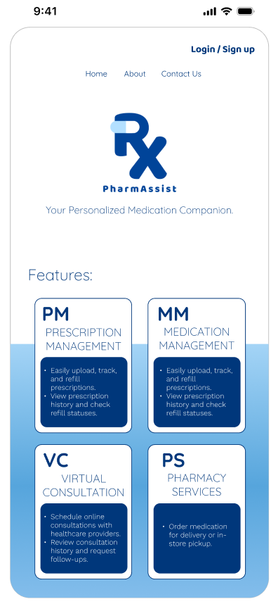

# Future-Smart-Pharmacy-System-Mobile-Version-

This repository contains the mobile UI/UX design for the Future Smart Pharmacy System, a digital healthcare solution designed to enhance medication management, prescription tracking, and patient–pharmacist interaction.

📖 Overview

The mobile version provides patients with a personalized and portable healthcare companion, allowing them to manage prescriptions, book consultations, and track medication adherence on-the-go.

✨ Key Features

1. Prescription Management (PM): Upload, track, and request refills.

2. Medication Management (MM): Personalized dosage reminders and adherence tracking.

3. Virtual Consultation (VC): Schedule and attend consultations with healthcare providers.

4. Pharmacy Services (PS): Order medicines via delivery, pickup, smart lockers, or even drone delivery.

5. Health Records (HC): Access and update medical history, allergies, and chronic conditions.

6. Patient Communication (PC): Secure in-app messaging with pharmacists and providers.

## Figma Design
[View the Prototype in Figma](https://www.figma.com/design/xuZ1K7ixBmUKMRxCZ2mQta/Future-Smart-Pharmacy-System-PHONEv?node-id=0-1&t=4bYAR6YFJi4I2yIf-1)

# Phone Preview

